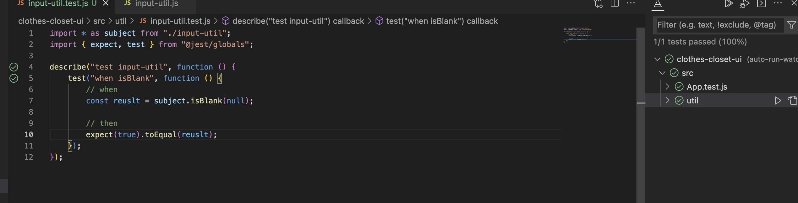

# Clothes Closet UI

This project was bootstrapped with [Create React App](https://github.com/facebook/create-react-app), and is the Frontend for the Clothes Closet System.

# Dev Setup

Follow the instructions at https://github.com/jvalentino/clothes-closet-rest for running the backend services locally.

# Running It

For locally:

```bash
npm run start:dev
```

This will launch the a local server at http://localhost:3000/ where you can work on the application.

The only difference between dev and prod is the URL used for backend services.

# Testing It

Running all tests with coverage:

```bash
npm run test
```

Running out of the IDE:

- You must first have installed the Jest Plugin via Orta

The result is that you get magic green bubbles to run tests:



# Build Automation

Husky is setup to run `npm run build:dev` prior to any change in source control, which handles running:

- prettier
- eslint
- test

... all prior to the actual build.

The production pipeline does the same, except using `npm run build`

# One Time Setup

## Custom Domain Name Setup

GoDaddy does not play nice, so I had to follow different instructions from https://successengineer.medium.com/how-to-setup-heroku-with-godaddy-d8e936d10849.

Summary

- GoDaddy: You have to purchase a domain name through a normal registar, I happen to do GoDaddy
- GoDaddy: As of a part of that purchase, you also need to get an SSL certificate. In my case with Goadday this was a part of the purchase
- Heroku: You can't configure SSL on eco dynos, so on Heroku you have to upgrade the dyno to basic
- Heroku: Upgrading to a Basic Dyno will automated enable [Automated Certificate Management (ACM)](https://devcenter.heroku.com/articles/automated-certificate-management) 
- Heroku: You then have to "Add Domain", for which was given www.clothescloset.app, however that will fail ACL
- Heroku: You then have to "Add certificate", and give it the public key, which is crt or pem, and then give it the private key
- GoDaddy:I had to change the CNAME of www from clothescloset.app. to hydrophobic-opossum-wr08a493ub5g96y180o2acm8.herokudns.com
- GoDaddy:Removed the A record of @ that was set to Parked
- This thus far gets the domain of https://www.clothescloset.app/ working
- I would not for the life of my get forwarding to handle removing www from the URL
- Google Cloud: Per https://console.cloud.google.com/apis/credentials/oauthclient/802540763450-gblh2ivaea2rjgk4rmemjulsnoa2968a.apps.googleusercontent.com?project=clothes-closet-374119, you have to add the new URL for https://www.clothescloset.app/ as an authorized origin to the OAuth credential


```
=== clothes-closet Custom Domains
 Domain Name           DNS Record Type DNS Target                                                 SNI Endpoint         
 ───────────────────── ─────────────── ────────────────────────────────────────────────────────── ──────────────────── 
 www.clothescloset.app CNAME           hydrophobic-opossum-wr08a493ub5g96y180o2acm8.herokudns.com mamenchisaurus-27941 
```


## Husky

It was setup using the following:

```bash
npx husky install
npx husky add .husky/pre-commit "npm run build:dev"
```

This makes it to where it runs `npm build:dev` and having it pass prior to being able to do any sort of commit.

